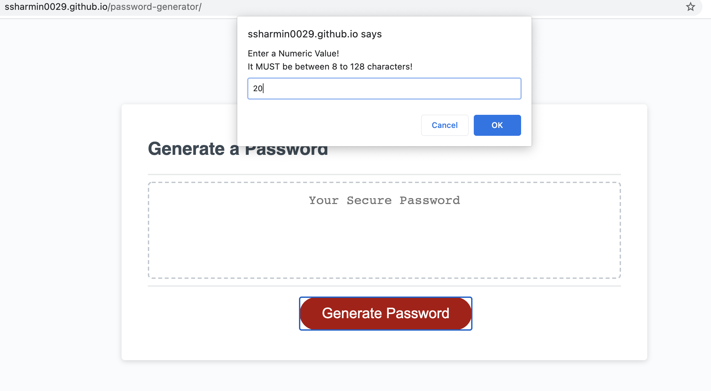
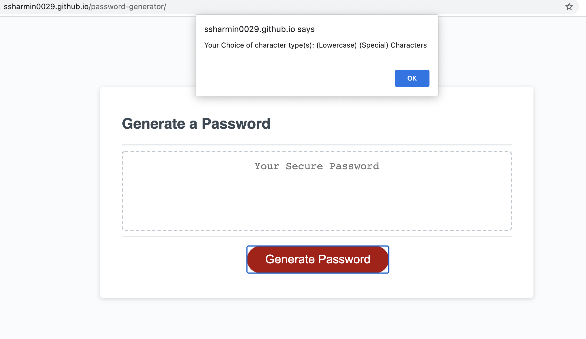
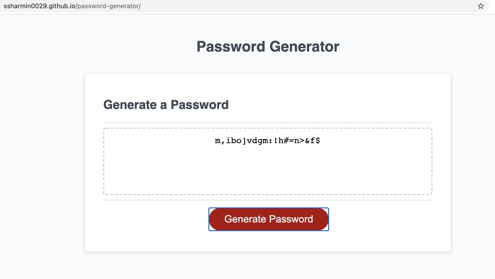

# password-generator

## Screenshot

## Description 
In this assignment we were asked to write an application that enables employees to generate  passwords randomly. For employees it is extremely important that they can create passwords, which are secured as they access sensitive data on a daily basis. Therefore we were given an acceptance criteria using which they can indeed create a strong and secure password. 

The acceptance criteria involved a series of prompts, where an employee gets to choose the length of his/her password but between 8 and 128 characters. They can choose among 4 different character types that involve lowercase, uppercase, numeric, and special characters. Not only that we were asked to validate user inputs as well. At the end of all prompts they should be able to generate a password that is random, and view it as a an alert or should be able to see it on the page. 

It was a very interesting program to write as it involved multiple steps, which I had to break down into smaller pieces for my own ease and so I can work efficiently. It required some thinking at first, which I turned into pseudocode initially. Then I started working on each pieces individually and build on as I kept implementing, using the pseudocode and acceptance criteria as my guide. 

Along the way I made sure to leave comments. Once I was done, I cleaned up the code, tested functionality  and fixed bugs when found any. Later, I optimized the code while repeating the same process as earlier. There was a lot to play with, which required teaching myself, do hands on work and learn in the process. Not only it was a help to the employees but I was able to develop my own skills further. 

To name some, here is what I did and used (JS):
- Declared Variables 
- Defined Arrays 
- Defined function plus wrote a helper function 
- Used while and for loops
- Made use of if statements 
- Used strings 
- Used prompt(), alert(), toUpperCase(), concat() methods 

## Deployed Application URL
[password-generator](https://ssharmin0029.github.io/password-generator/)

[Click Here to Contact](https://ssharmin0029.github.io/portfolio-website-ss/)